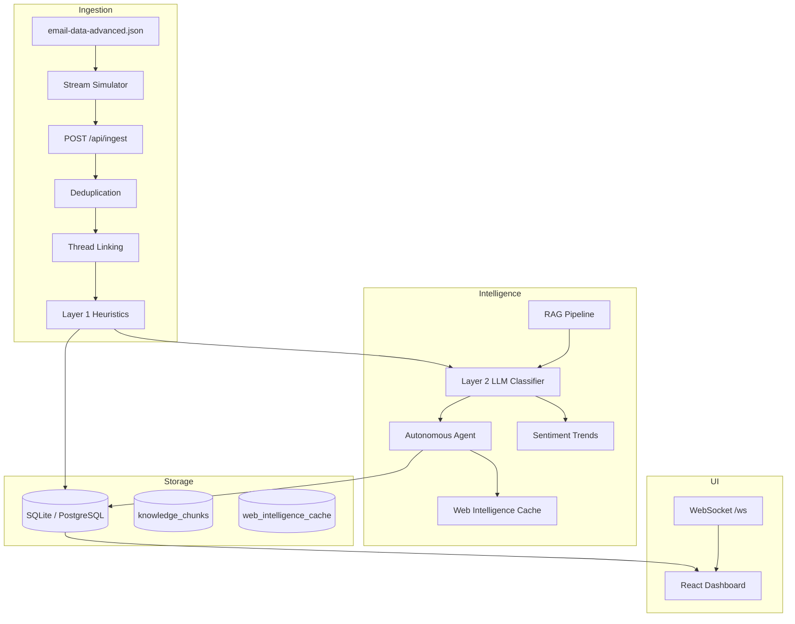
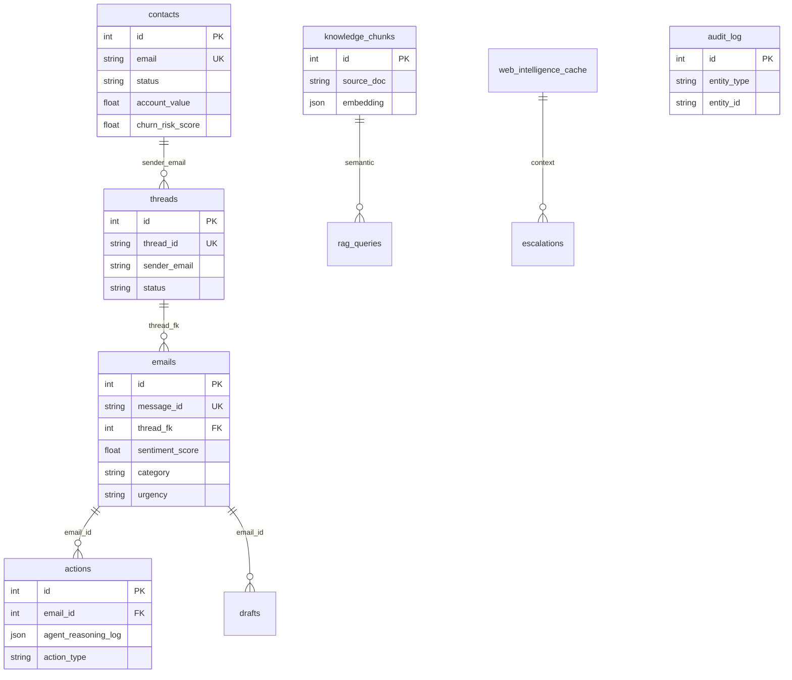

# SenAI Agentic CRM — Architecture

## System Overview

## ER Diagram

## Data Flow (Single Email)

1. **Ingest** — Validate schema → dedupe by `message_id` → link/create `threads` → heuristic priority
2. **Classify** — Load full thread history → RAG top-3 chunks → LLM/rule classifier → confidence gate
3. **Agent** — Scenario-specific workflow (GDPR, ransomware, chatbot, reputation, auto-reply, escalate)
4. **Persist** — Update email, actions, audit_log, contact churn risk, sentiment trend

## Trade-offs

| Decision | Choice | Rationale |
|----------|--------|-----------|
| Database | SQLite default, Postgres optional | Zero-config demo; production uses Postgres + pgvector |
| Embeddings | Hash-based local vectors | No GPU/API required for assessment; swap for OpenAI embeddings in prod |
| LLM | Rule engine + optional OpenAI | Deterministic scenario handling for eval; real LLM when `OPENAI_API_KEY` set |
| Processing | Sync on ingest | Simpler than Celery for take-home; scale with Redis queue workers |
| Web intel | Cached mock G2/Trustpilot | Real scraping rate-limited; structure supports live BeautifulSoup fetch |

## Failure Modes

- **Duplicate ingest** → 200 with `status: duplicate`, no double processing
- **Malformed JSON** → 422 with `error_code`, `message`, `details`
- **Empty body+subject** → `EMPTY_EMAIL` rejection
- **confidence < 0.70** → forced `requires_human`
- **Ransomware/spam** → never auto-reply
- **LLM timeout** → fallback to rule-based classifier

## Conflicting Signal Resolution

When an email expresses opposing sentiments (e.g. love product + hate price + refund):
- Set `sentiment=Mixed`, `sentiment_score` near neutral-negative
- Lower `confidence` (e.g. 0.62) → triggers human review per 0.70 threshold
- `escalation_reason` documents both signals; agent escalates rather than auto-replies

## Performance

- Thread query: eager-load emails via `selectinload` — target <100ms for ≤50 emails
- Sentiment trend: index on `(sender, timestamp)` — see `ix_emails_sender_timestamp`
- Vector search: in-memory cosine over KB chunks (<200ms for small KB)
